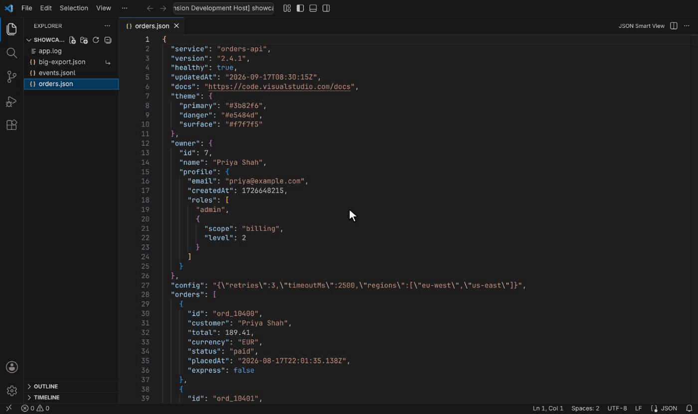
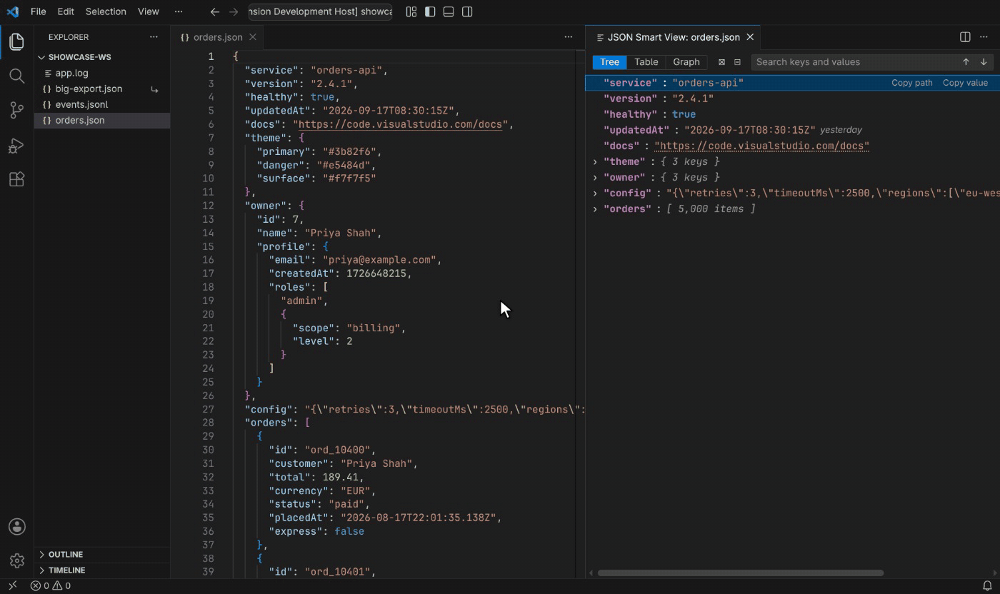
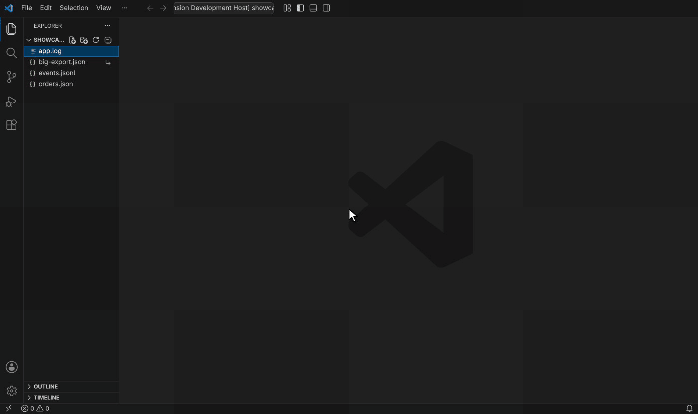
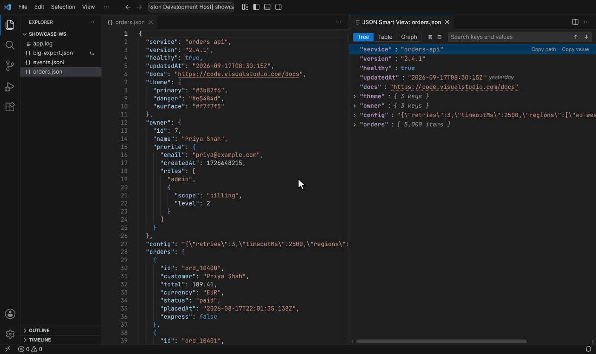

# JSON Smart Viewer

Explore big or messy JSON as a tree, table or graph, side by side with your editor.

## Features

- **Open from the editor title** of any JSON file, or right-click a file in the Explorer.
- **Linked to your editor**: click a value to select it in the file, or click in the file to reveal it in the viewer. Edits show up once you pause typing.
- **Search** keys and values, including escaped text. **Enter** and **Shift+Enter** step through matches.
- **Copy** a path (`orders[12].total`), JSON Pointer or value from the right-click menu, or copy the selected value with **Ctrl+C** / **Cmd+C**.
- **Previews**: colour swatches, readable dates and timestamps, and links that open with **Ctrl+click** / **Cmd+click**.
- **Table and graph views**: sort arrays and maps of objects by any column, or explore nesting as cards you can pan and zoom.

  

- **Large files**: files of hundreds of megabytes open in a second or two, because only what's on screen is built. Big arrays and objects open in groups of 100.

  

- **More than plain JSON**: JSON inside strings opens like any object, JSONC comments are fine, and JSON Lines files show bad lines with their line number. To view JSON inside any other file, such as a log line, select it and choose **Open Selection in JSON Smart View**.

  

- Follows your theme, works offline, and shows big numbers exactly as written.

## Requirements

- VS Code 1.90 or later.

## Known Issues

- **VS Code doesn't share files over 50 MB with extensions.** For those, clicking in the viewer still jumps to the value in the editor, but the viewer can't follow the cursor or your unsaved edits. It refreshes when the file is saved.
- Inserting an item into an array shifts the indexes after it, so an open `orders[5]` then shows whatever is now at position 5.
- Paths nested more than 1,000 levels deep are revealed down to level 1,000.
- JSON inside strings opens in the tree; the table and graph show those strings as text.

Report issues on [GitHub](https://github.com/mashurr/json-smart-viewer/issues).

## Release Notes

See [CHANGELOG.md](CHANGELOG.md).
